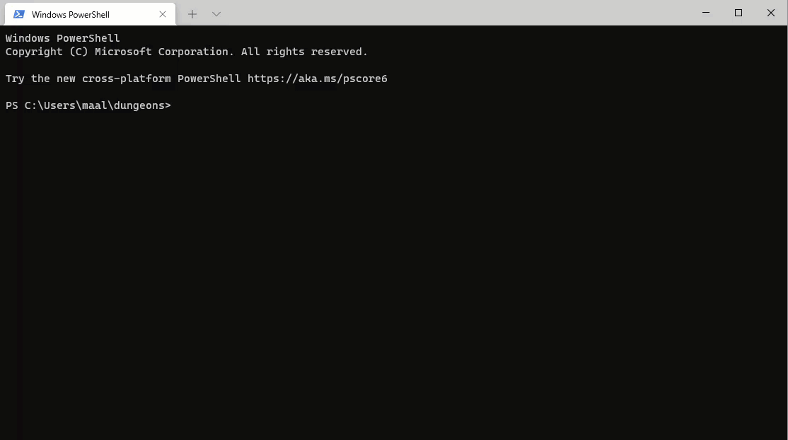

# Leaving dungeons 
This is a recruitement task exercise.
Here is a java project which has a 'game' of dungeons. 
You can start it from your IDE by executing main class : the.dungeons.Game; it will read data from standard input (i.e. console) and hand you answers.
The objective is to reach end.
What you need to do is to slay a monster and give it's trophy to a Wizard. Once you do it, an exit path is opened. Once you find it , a (end) command is possible to execute which ends the game.

There is a pattern in responses from the game. All possible actions are visible between '()' and are separated by ','. 
For example in a single message:
* (n,s,w) to move
* (open) You see a closed chest

says that you can execute commands n,s,w,open

Your task is to deliver a program which will manage to end the game.
There is a trivial example of it as an unit test: 'SmallJourneyTest'.

The solution is a class which accepts 'Engine' instance and manages to set gameOver flag to true. As Engine class only accepts a 'command' method, your task is to communicate with a game by calling commands.

The proper solution would always manage to end a game (provided that there is an ending).
It is a bonus task to figure out that there is no end game, either by missing wizard, missing chest with a key, missing ending room or missing monter.

Good luck.

 